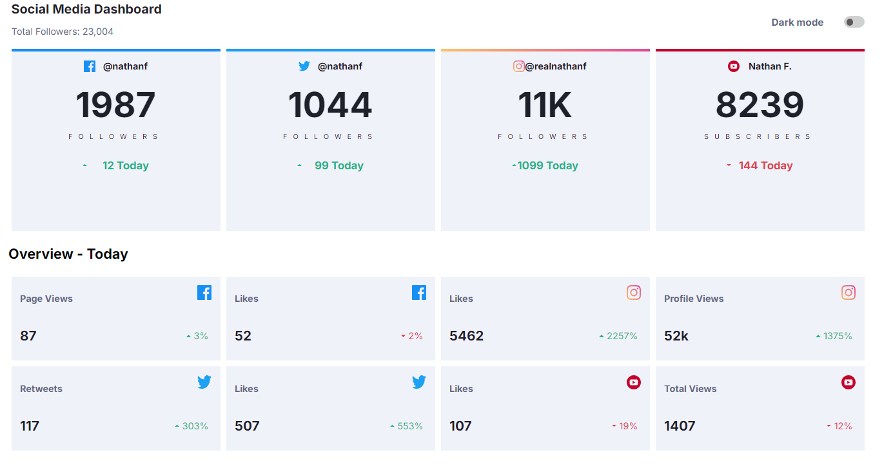

# Frontend Mentor - Social media dashboard with theme switcher solution

This is a solution to the [Social media dashboard with theme switcher challenge on Frontend Mentor](https://www.frontendmentor.io/challenges/social-media-dashboard-with-theme-switcher-6oY8ozp_H). Frontend Mentor challenges help you improve your coding skills by building realistic projects. 

## Table of contents

- [Overview](#overview)
  - [The challenge](#the-challenge)
  - [Screenshot](#screenshot)
  - [Links](#links)
- [My process](#my-process)
  - [Built with](#built-with)
  - [What I learned](#what-i-learned)
  - [Continued development](#continued-development)
- [Author](#author)

## Overview

### The challenge

Users should be able to:

- View the optimal layout for the site depending on their device's screen size
- See hover states for all interactive elements on the page
- Toggle color theme to their preference

### Screenshot

### Links

- Solution URL: [Solution](https://github.com/Avantiermv/social-media-dashboard-challenge)
- Live Site URL: [Live Site](https://avantiermv.github.io/social-media-dashboard-challenge/)

## My process

### Built with

- Semantic HTML5 markup
- CSS custom properties
- CSS Grid
- Mobile-first workflow

### What I learned

I learned how to use the flexbox, but i have to learn much more yet about this.

### Continued development

I'm going to study a lot more javascript and add typescript to my studies, flexbox and grid-layout. I'm going to focus part of my learning on the frontend, but my goal is the backend.

## Author

- Frontend Mentor - [@Avantiermv](https://www.frontendmentor.io/profile/Avantiermv)

